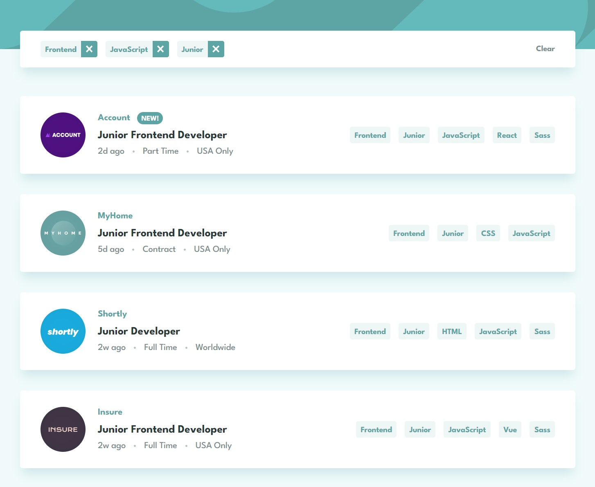

# Frontend Mentor - Job listings with filtering solution

This is a solution to the [Job listings with filtering challenge on Frontend Mentor](https://www.frontendmentor.io/challenges/job-listings-with-filtering-ivstIPCt). Frontend Mentor challenges help you improve your coding skills by building realistic projects.

### The challenge

Users should be able to:

- View the optimal layout for the site depending on their device's screen size
- See hover states for all interactive elements on the page
- Filter job listings based on the categories

### Screenshot

**Desktop**

**Mobile**

### Links

- Solution URL: https://github.com/aaronrubinstein/job-listings
- Live Site URL: https://aaronrubinstein.github.io/job-listings/

### Built with

- HTML5
- CSS
- [Svelte](https://svelte.dev/)
